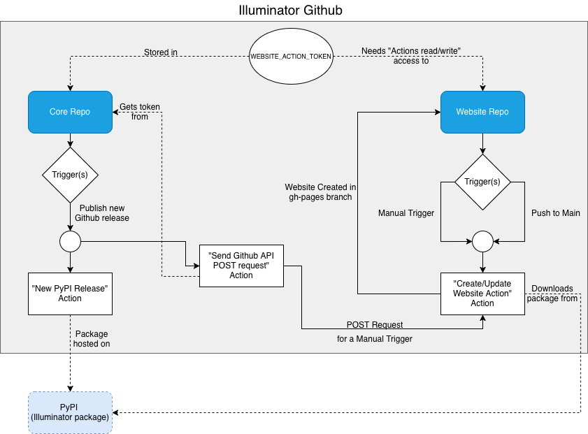

# Website automation and github actions
In order to automate some tedious processes we have created a new action on github called *Start docs update for website*, defined within the *. This github action allows the website code to be automatically updated with every push to main. 

## Visual representation of github actions
The image below contains a visual representation of how two of our repositories interact with one another. The simpler of the two, website repo, only contains one action which can be started by two triggers. Either manually or through a push to the main branch. Once either of these trigger the *Create/Update Website Action*, the website is then automatically created and pushed into a separate branch on the Website repository (gh-pages branch). The Core repository contains multiple different actions, however only the two relevant actions are shown. Publishing a new release on github triggers the *New PyPI Release Action*. Pushing into main triggers *Send Github API POST request*. In order for the illuminator package to be hosted on PyPI, we must first trigger *New PyPI Release Action* by creating a new github release on the Core repository. This PyPI illuminator package is what our website repository is referring to when automatically updating the documentation. The other action, *Send Github API POST request*, uses the secret token **WEBSITE_ACTION_TOKEN** to gain access to the Website Repo's actions, and triggers *Create/Update Website Action* as if it was manually triggered. This secret token is hosted within Core Repo's secrets, while it was created with the specific Actions read/write access rights exclusive to the website repository.

	

## Action Token
In order to trigger an action in a different repository an appropriate token must be created. This token is similar to the one created for access to github over a personal computer. 

The steps necessary to create an appropriate token:
1. Go to your account -> settings -> developer settings
2. Personal access tokens -> Fine-grained tokens -> Generate New Token
3. Give the token any name
4. Change resource owner to illuminator-team
5. Set an expiration date (the maximum is set by the illuminator-team)
6. (Optional) Give a request message
7. Set Repository Acces to Only select repositories
8. Add Illuminator-team/website as your selected repository
9. Under permissions add Actions and set to Read and Write
10. Double check that there is 1 selected repository and 2 permissions (Actions and Metadata)
11. Click Generate token and request access

## Potential alterations/improvements
- There is an action *Run Tests*, whose output is currently irrelevant to the website. It is possible to use *Run Tests* action as a prerequisite to *Send Github API POST request* action in order to double check if all the tests pass before updating the website.
- Because the website uses the PyPI release of illuminator, if the code docstrings are altered and we wish for it to be visible on the illuminator website we must trigger *New PyPI Release Action* after we have created a push to main. Updating the website takes around 10 minutes, which gives plenty of time to create a new release, however it might be easier to simply change the trigger of *Send Github API POST request* from Push to Main to Publish new Github release.
- The logic of using the Core Repo to trigger something on another repository could be reused for other repos as well. For example, for the Cluster Repo one could copy paste the action *Send Github API POST Request*, alter a few names and create a new secret token in a similar fashion to **WEBSITE_ACTION_TOKEN**. The only thing new would be the Action which is triggered in the Cluster Repo (for example: running tests)

